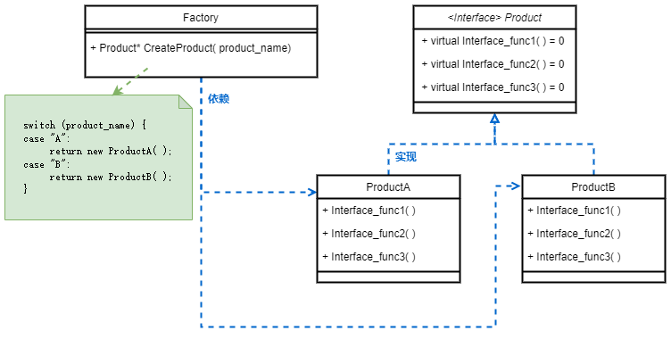
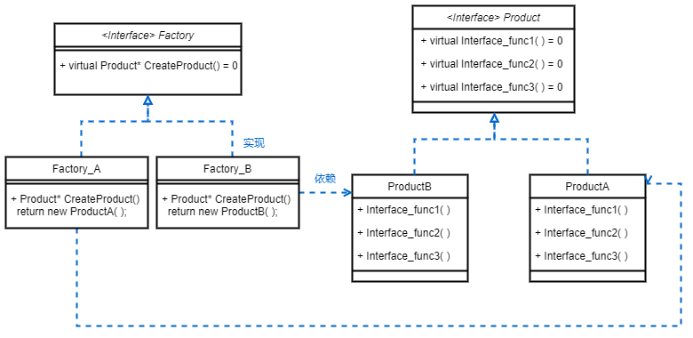
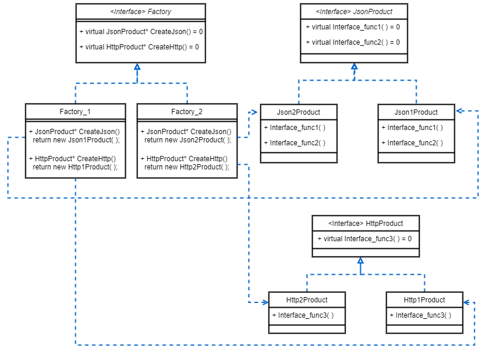
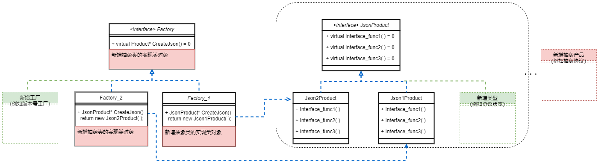
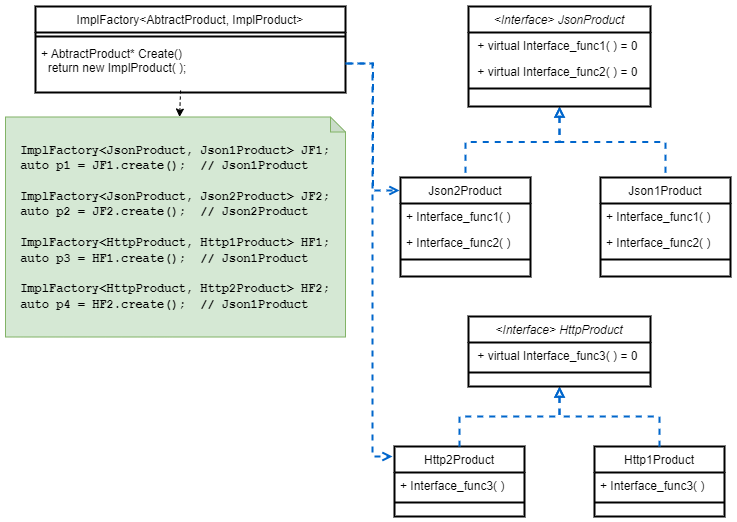
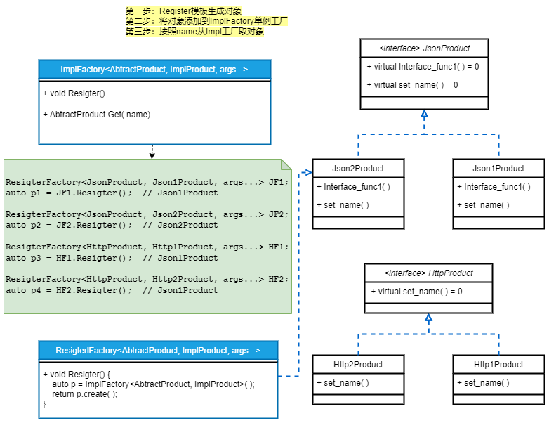

# 知识点
完成比完美更重要

## 1.创建模式
### 1.1 单例模式
- [使用场景] 系统有多个资源，但只有一个资源管理器。例如公共配置类、资源类、日志类等
- [要点词语] static、=delete、=default、virtual、template、friend
- [异常问题] 并发，性能，如何保障不能创建多实例
- [底层保障]  
    - C++11标准中的Magic Static特性：If control enters the declaration concurrently while the variable is being initialized, the concurrent execution shall wait for completion of the initialization.
    如果当变量在初始化的时候，并发同时进入声明语句，并发线程将会阻塞等待初始化结束。
    这样保证了并发线程在获取静态局部变量的时候一定是初始化过的，所以具有线程安全性。
- [核心实现]
    - 将默认拷贝构造、赋值构造删除
    - 构造函数private
    - 唯一入口获取实例：实例为static运行期不释放，实例为引用不是指针，防止提前delete
    - 尽量不用锁，减少性能损耗
- [继承单例]
    - 将子类作为模板传入，从而保证基类的getInstance( )入口可以初始化子类对象。注意这里和动态类调用的区别，由于子类构造私有，动态类仍只能获得基类对象，不是预期的子类对象；
    - 基类为友元类，因为基类GetInstance( )要调用子类的私有构造
    - 基类的构造由private，改为protected，因为子类的构造前会先调基类的构造
    - 基类的析构，改为virtual

### 1.2 简单工厂（少用）
- [核心实现] 子类继承自统一父类，工厂由入参创建的对象
- [使用场景] 相同接口的产品类，继承统一抽象类，对使用者暴露工厂类，用于创建对象。使用者无需感知各子类名，只需传递名称字符串
- [设计弊端] 子类扩展，需要修改工厂，对现有代码有侵入性
  

### 1.3 工厂方法模式（常用）
- [核心实现] 工厂类只是抽象接口，每个子类对应一个工厂实现类。工厂实现类和子类个数是1：1
- [使用场景] 新增子类，无需修改已有工厂，对现有代码无侵入性（不修改只新增）
- [设计弊端] 每增加一个子类，对应增加一个工厂实现类，导致工厂类和产品类过多
  

  
### 1.4 抽象工厂模式（少用）

- [核心实现] 将产品抽象类由1个，扩展为多个。不同工厂实现类创建N个产品实现类
- [设计弊端] 扩充产品抽象类的子类实现，需要对应增加工厂实现类
- [扩充例子] 下图是扩充后的例子

###$ 1.4.1 抽象工厂、模板工厂
- [核心实现] 对抽象工厂的升级，将工厂实现类抽象成模板，将产品抽象类和实现类作为模板参数传入
- [备注说明] 
  - 由于不同产品抽象类的构造入参不同，抽象模板类最后是可变参数，用于创建实际的产品类对象
  - 如果实现工厂模板有多个，也需要抽象工厂类，确保统一接口
 

#### 1.4.2 抽象工厂、模板工厂、注册工厂
- [核心实现] 对抽象工厂的再次升级，用于实现产品类注册，和按名称查找。增加注册模板类
- [备注说明] 也可直接调用ImplFactory的模板类Resigter()函数，原因？

