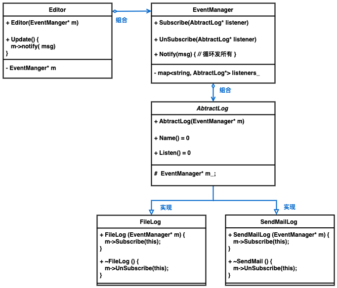
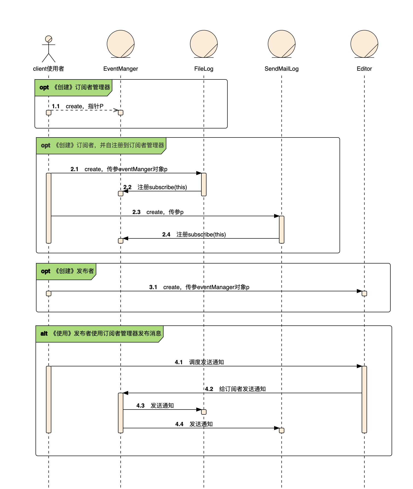

<!--
 * @Descripttion: 
 * @version: 
 * @Author: danae
 * @Date: 2022-07-20 17:30:06
 * @LastEditors: danae
 * @LastEditTime: 2022-07-22 17:54:56
-->
## 3.1 责任链
- [使用场景]
    - 程序需要使用不同方式处理不同种类请求，且请求类型和顺序未知时
    - 该模式形成一条链，收到请求后，会问询每个处理这，都有机会处理请求
    - 处理顺序必须在运行时改变，可以动态插入或移除处理者，改变其顺序
- [核心实现] 
    - 各处理者继承同一抽象类，且包含成员变量指向下一个处理者
    - 处理者接收到请求后做出2个决定，是否自行处理请求，是否将该请求沿着链传递
    - 客户端可以自行组织链，或者从其他对象获得预先组装好的链（实现工厂类根据配置或环境变量创建链）
    - 由于链的动态性，客户端请求可能：
        - 链中只有单个链接
        - 不能请求可能无法到链尾
        - 其他请求可能直到链尾都未被处理
- [注意区别]
    - **责任链**按照顺序将请求动态传递给一系列的潜在接收者， 直至其中一名接收者对请求进行处理
    - **命令**在发送者和请求者之间建立单向连接
    - **中介者**清除了发送者和请求者之间的直接连接， 强制它们通过一个中介对象进行间接沟通
    - **观察者** 允许接收者动态地订阅或取消接收请求

## 3.2 命令
- [整体说明]
   - `客户端`根据配置等将`命令`和`接收者`及命令的入参提前绑定。`触发器`在使用时直接调用命令，不必传参也不感知`接收者`。实现了触发器和接收者的解耦，更加灵活，且新增命令不必修改现有代码。
- [使用场景]
   - [命令和对象分离] CUI菜单，支持用户配置菜单项，并点击触发操作
   - [操作放入队列] 命令可序列号（转为字符串）存储。延迟初始化等
   - [回滚或重放] 命令历史记录包含所有执行命令和状态备份的栈机构，虽和备忘录结合，仍占用内存

- [核心实现]
    - **触发者invoker**: 不创建命令，只从客户端获得现有命令，并调命令执行
    - **命令command**: 声明一个 执行命令的方法，且无入参
    - **具体命令ImplCmd**: 实现各种类型的请求，委派给接受者执行。构造函数中指定Receiver和执行命令所需参数
    - **接收者Receiver**: 实际执行工作
    - **客户端client**: 创建具体的命令对象，将命令与Receiver关联，将invoker与多个command关联

- [注意区别]
   - **命令** 发送者和接收者建立单向连接
   - **中介者** 发送者和接收者通过中介对象间接沟通
   - **观察者** 允许接收者动态订阅取消接收请求

## 3.3 迭代器
- [整体说明]
    - 方法1: 通过已有的vector内存放模板实现
    - 方法2：迭代器包装自实现的循环逻辑，hasNext()等函数
- [使用场景]
    - **对客户端屏蔽内部复杂数据结构** 迭代器封装与复杂结构交互的细节，为客户端提供多个访问集合元素的简单方法
    - **减少程序中重复的遍历代码** 如果将复杂的迭代算法放在业务逻辑中，会让功能类的职责不清楚，降低维护性
    - **遍历不同的数据结构的通用模式** 通过将集合类传递给迭代器，实现通用的循环输出能力
- [核心实现]
    - **迭代器类**包含方法：获取下个元素、获取当前位置、判断迭代器是否结束
    - **集合类**创建迭代器对象，将自身类型作为模块参数传递，将自身对象作为参数传递给迭代器
    - **客户端**使用时，通过迭代器对象遍历集合全部元素

## 3.4 中介者
- [整体说明]
    - 通过中介者进行不同对象间交互，单一对象只引用中介者，而不用与其他对象耦合
- [使用场景]
    - **和其他对象解耦** 将对象间所有关系抽取一个单独类，使对于特定组件的修改独立于其他组件
    - **复用组件间合作关系** 无需修改组件，只提供一个新的中介者
- [核心实现]
    - **抽象中介者类** 一般只实现通知方法即可，如果要负责所有对象的创建和销毁，可与工厂结合
    - **组件(对象)类** 包含中介者的引用，在构造函数中传递进来
- [注意区别]
    - 用于处理请求发送者和接收者的不同连接方式
        - **责任链**按照顺序将请求动态传递给一系列的潜在接收者， 直至其中一名接收者对请求进行处理
        - **命令** 在发送者和请求者之间建立单向连接
        - **中介者** 清除了发送者和请求者之间的直接连接， 强制它们通过一个中介对象进行间接沟通
        - **观察者**允许接收者动态地订阅或取消接收请求
    - 尝试在大量紧密耦合的类中组织起合作
        - **外观** 为子系统中的所有对象定义了一个简单接口， 但是它不提供任何新功能。 子系统本身不会意识到外观的存在
        - **中介者** 将系统中组件的沟通行为中心化。各组件只知道中介者对象， 无法直接相互交流。目标是消除组件间的相互依赖
        - **观察者** 目标是在对象之间建立动态的单向连接
        - **中介者与观察者结合** 中介者对象担当发布者的角色， 其他组件则作为订阅者， 可以订阅中介者的事件或取消订阅

## 2.5 观察者
- [整体说明]
  - 订阅消息和消息发放
- [使用场景]
  - 一个对象的改变需要改变其他对象，例如客户端自定义按钮和实现，通过自定义订阅类注入自定义代码
  - 对象依赖观察其他对象，注意订阅列表是动态的，可以随时加入和离开
- [核心实现]
  - **发布者** 包含接口添加、删除订阅对象。也可以使用组合方式，用订阅者管理器发送消息
  - **订阅者** 包含update()方法，参数可包含发布者自身用于获取数据，或者通过构造函数将发布者和订阅者永久关联，但这样不灵活。
  - **使用方** 客户端完成发布者注册工作，代码里在订阅者构造函数里自注册，这样将发布者和订阅者绑定不灵活
- [优缺点]
  - 符合开闭原则
  - 在运行时建立对象间联系
  - 但订阅者的通知顺序是随机的
  

## 2.6 备忘录（快照）
- [整体说明]
  - 生成快照，管理快照（指挥恢复到哪个快照对象）
- [使用场景]
  - **恢复之前状态** 记录操作过程，处理事务、回滚或撤销。备忘录让对象自行负责创建快照，任务其他对象都不能读取快照，有效保障了数据的安全性
- [核心实现]
  - **备忘录类** 设置为不可变（不能有设置器），通过构造函数一次性接收数据
  - **原发器** 创建备忘录的方法，恢复状态的方法。
  - **负责人** 可能是命令对象、历史记录等，知道何时让原发起创建新备忘录、存储备忘录、知道何时恢复
- [优缺点]
  - 过于频繁创建备忘录，消耗内存
  - 负责人必须完整跟踪原发器生命周期，才能销毁废弃的备忘录
  - 一些动态远程语言PHP、Python、JS无法保证备忘录中的状态不被修改

