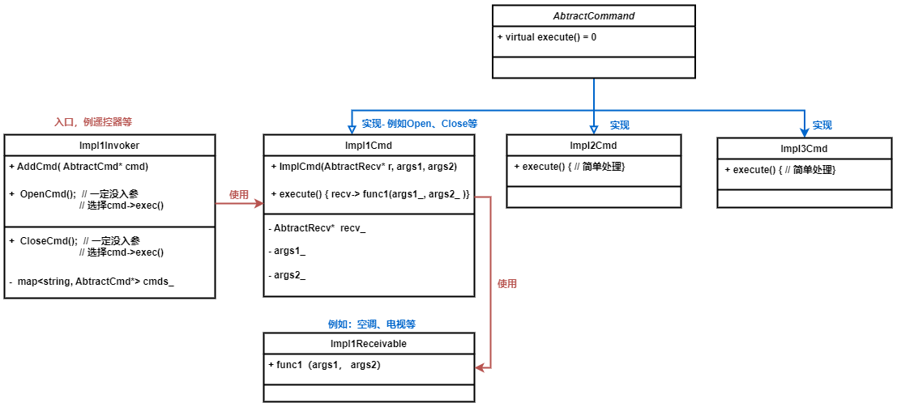

### 3.1 责任链
- [使用场景]
    - 程序需要使用不同方式处理不同种类请求，且请求类型和顺序未知时
    - 该模式形成一条链，收到请求后，会问询每个处理这，都有机会处理请求
    - 处理顺序必须在运行时改变，可以动态插入或移除处理者，改变其顺序
- [核心实现] 
    - 各处理者继承同一抽象类，且包含成员变量指向下一个处理者
    - 处理者接收到请求后做出2个决定，是否自行处理请求，是否将该请求沿着链传递
    - 客户端可以自行组织链，或者从其他对象获得预先组装好的链（实现工厂类根据配置或环境变量创建链）
    - 由于链的动态性，客户端请求可能：
        - 链中只有单个链接
        - 不能请求可能无法到链尾
        - 其他请求可能直到链尾都未被处理
- [区别]
    - **责任链**按照顺序将请求动态传递给一系列的潜在接收者， 直至其中一名接收者对请求进行处理
    - **命令**在发送者和请求者之间建立单向连接
    - **中介者**清除了发送者和请求者之间的直接连接， 强制它们通过一个中介对象进行间接沟通
    - **观察者** 允许接收者动态地订阅或取消接收请求

### 3.2 命令
- [整体说明]
   - `客户端`根据配置等将`命令`和`接收者`及命令的入参提前绑定。`触发器`在使用时直接调用命令，不必传参也不感知`接收者`。实现了触发器和接收者的解耦，更加灵活，且新增命令不必修改现有代码。
- [使用场景]
   - [命令和对象分离] CUI菜单，支持用户配置菜单项，并点击触发操作
   - [操作放入队列] 命令可序列号（转为字符串）存储。延迟初始化等
   - [回滚或重放] 命令历史记录包含所有执行命令和状态备份的栈机构，虽和备忘录结合，仍占用内存

- [核心实现]
    - **触发者invoker**: 不创建命令，只从客户端获得现有命令，并调命令执行
    - **命令command**: 声明一个 执行命令的方法，且无入参
    - **具体命令ImplCmd**: 实现各种类型的请求，委派给接受者执行。构造函数中指定Receiver和执行命令所需参数
    - **接收者Receiver**: 实际执行工作
    - **客户端client**: 创建具体的命令对象，将命令与Receiver关联，将invoker与多个command关联

- [注意区别]
   - **命令** 发送者和接收者建立单向连接
   - **中介者** 发送者和接收者通过中介对象间接沟通
   - **观察者** 允许接收者动态订阅取消接收请求

