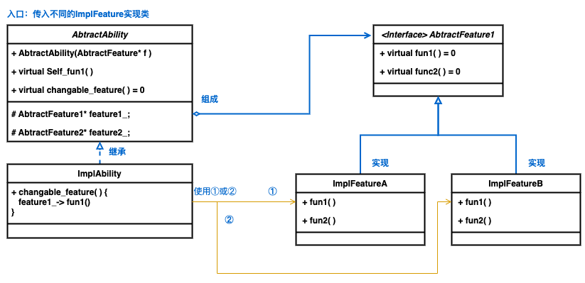
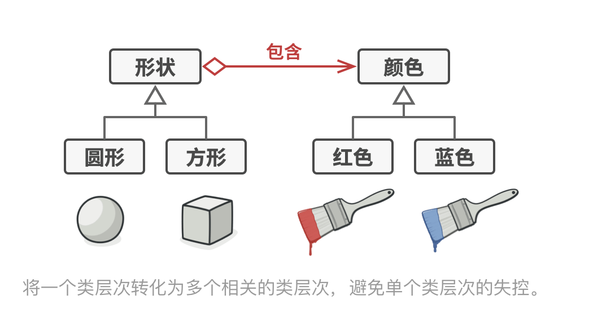
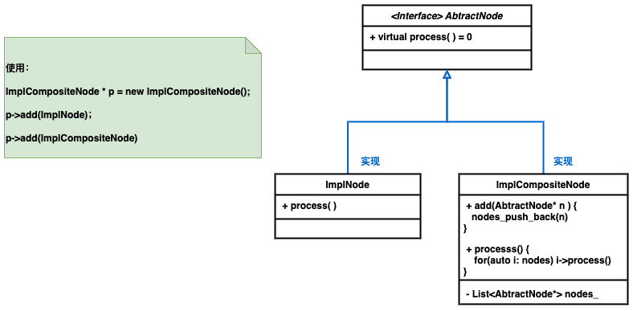
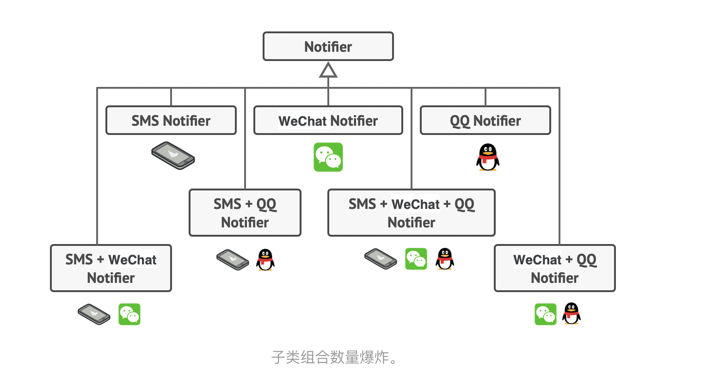
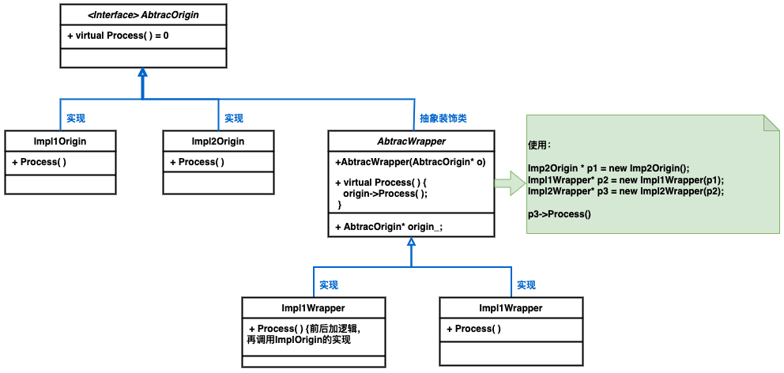
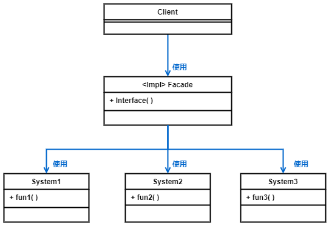
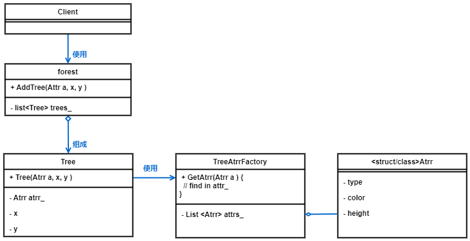
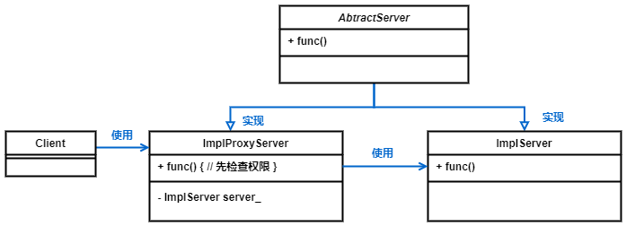

<!--
 * @Descripttion: 
 * @version: 
 * @Author: danae
 * @Date: 2022-07-15 11:41:49
 * @LastEditors: danae
 * @LastEditTime: 2022-07-19 15:37:51
-->
## 2.结构型模式
### 2.1 适配器 Adapter
- [使用场景]
    - 服务器端在不改动现有接口基础上，支持客户端的特殊请求
- [核心实现]
    - 单独使用一个类Adapee处理客户端的特殊请求
    - 适配器同时继承Server和Adapee，将需要特殊处理的请求重载，调用Adapee实现
- [注意说明] 
    - 误区是修改现有server接口，识别特殊请求后调用Adapee能力，避免是扩散到所有客户端，现在只需要有特殊需要的客户端使用适配器类即可

### 2.2 桥接 Bridge
- [使用场景] **将一个类的部分会变的功能拆分成抽象类并引用，用组合而非继承**
- [核心实现] 
    - 对外提供功能的类A，分为抽象A、实现A1类、实现A2类等
    - 功能类B，分为抽象B、实现B1类、实现B2类
    - 类A中包含抽象B类的引用

### 2.3 递归组合
- [使用场景] 层次结构中存在递归组合的模式，有叶子节点、和叶子节点组成的分支组成
- [核心实现]
    - 叶子节点和由叶子节点组成的分支，继承同一抽象类

 

### 2.4 装饰(封装模式)-支持递归
- [使用场景]
    -  替代继承，避免子类过多
    -  继承是静态的，装饰将业务逻辑分层，且各层在运行时将不同逻辑组合成对象？支持配置
    - 如果类用final关键字限制继承，可以采用这种封装 
- [核心实现]
    - 抽象一个封装类，继承原有的抽象实现类，且包含一个抽象实现类成员对象
    - 支持按照不同的具体实现类封装
    - 支持封装时传递其他封装实现类
- [和其他模式区别]
    - 封装模式不改变对象接口的前提下强化对象功能
    - 适配器模式对已有对象接口修改

### 2.4 外观模式
- [使用场景] 使用地方库或复杂系统，封装一层外观类，不用感知内部的实现逻辑和版本升级

### 2.5 享元模式
- [使用场景] 解决创建大量对象时占用内存多的问题
- [核心实现] 
    - 将内部状态和外部状态分离出来，内部状态是独有的，外部状态大量的类有很高的相似度
    - 外部状态用单独类管理，使用工厂模式从map或list中取出已有的对象

### 2.6 代理模式
- [使用场景] 
    - [访问控制，保护代理] 对原始接口增加权限校验等
    - [延迟虚拟化（虚拟代理）] 避免偶尔访问的重量级服务对象消耗资源，代理负责对象声明周期，真正使用时才初始化
    - [本地执行远程服务] 代理通过网络传递客户端请求
    - [缓存请求结果（缓存代理）] 缓存客户端请求结果并对缓存生命周期管理
    - [智能引用] 无客户端请求时销毁对象
- [核心实现] 
    - 方法一：代理类和服务类继承同一抽象类，且接口相同
    - 方法二：代理类是服务类的子类
    - 只有代理类对外提供服务，包含一个成员变量指向服务类
    - 可以考虑建工厂或静态方法，来选择客户端可获取的是代理或实际服务
    - 可以考虑实际服务的延迟初始化
- [区别]
    - 适配器是封装不同接口，代理是提供相同接口，装饰是加强接口功能

