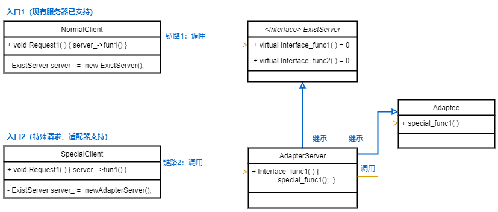

## 2.结构型模式
### 2.1 适配器
- [使用场景]
    - 服务器端在不改动现有接口基础上，支持客户端的特殊请求
- [核心实现]
    - 单独使用一个类Adapee处理客户端的特殊请求
    - 适配器同时继承Server和Adapee，将需要特殊处理的请求重载，调用Adapee实现
- [注意说明] 
    - 误区是修改现有server接口，识别特殊请求后调用Adapee能力，避免是扩散到所有客户端，现在只需要有特殊需要的客户端使用适配器类即可
